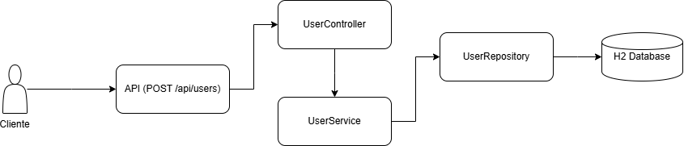

# User API - Spring Boot

Esta aplicación expone un API RESTful para la creación de usuarios.

Todos los endpoints aceptan y responden únicamente en formato **JSON**, incluyendo los mensajes de error.

Formato estándar de error:

```json
{
  "mensaje": "mensaje de error"
}
```

---

## Tecnologías utilizadas

- Java 17
- Spring Boot 3
- H2 Database (en memoria)
- JPA (Hibernate)
- Gradle
- JWT para manejo de tokens

---

## Cómo levantar el proyecto

1. **Clonar el repositorio:**

```bash
git clone https://github.com/YamiCueto/api-users.git
```

2. **Ingresar a la carpeta del proyecto:**

```bash
cd api-users
```

3. **Ejecutar la aplicación:**

```bash
./gradlew bootRun
```
ó en Windows:

```bash
gradlew.bat bootRun
```

La aplicación correrá en:  
`http://localhost:8080`

---

## Cómo probar el registro de usuario

### Endpoint

**POST** `http://localhost:8080/api/users`

### Headers requeridos

```
Content-Type: application/json
Accept: application/json
```

### Body de ejemplo

```json
{
  "name": "Juan Rodriguez",
  "email": "juan@rodriguez.org",
  "password": "Hunter2!",
  "phones": [
    {
      "number": "1234567",
      "citycode": "1",
      "contrycode": "57"
    }
  ]
}
```

### Ejemplo de respuesta exitosa (HTTP 201)

```json
{
  "id": "b6b9a1c5-8f15-4c55-b2a3-f39b2b91d69f",
  "created": "2025-04-26T21:00:00",
  "modified": "2025-04-26T21:00:00",
  "lastLogin": "2025-04-26T21:00:00",
  "token": "un-token-o-uuid-generado",
  "isActive": true
}
```

### Ejemplo de respuesta de error (correo ya registrado)

```json
{
  "mensaje": "El correo ya registrado"
}
```

### Cómo probar usando `curl`

```bash
curl -X POST http://localhost:8080/api/users -H "Content-Type: application/json" -H "Accept: application/json" -d '{
  "name": "Juan Rodriguez",
  "email": "juan@rodriguez.org",
  "password": "Hunter2!",
  "phones": [
    {
      "number": "1234567",
      "citycode": "1",
      "contrycode": "57"
    }
  ]
}'
```

---

## Base de datos H2

- Consola: `http://localhost:8080/h2-console`
- JDBC URL: `jdbc:h2:mem:testdb`
- Usuario: `sa`
- Contraseña: *(vacío)*

---

## Validaciones implementadas

- Formato de correo electrónico validado mediante expresión regular.
- Formato de contraseña validado mediante expresión regular configurable.
- No se permiten correos duplicados.
- Mensajes de error siempre en formato JSON.

---

## Diagramas de la solución

### 1. Diagrama de Secuencia - Flujo de Registro de Usuario


### 2. Diagrama General de Componentes



---

## Cómo correr las pruebas unitarias

```bash
./gradlew test
```

## 🚀 Automatización CI/CD

Este proyecto cuenta con integración continua (CI) configurada mediante **GitHub Actions**.

Cada vez que se realiza un `push` o `pull request` hacia la rama `main`:
- Se ejecuta automáticamente la compilación (`build`) del proyecto.
- Se ejecutan las pruebas unitarias.
- Se genera y publica el reporte de cobertura de pruebas (**Jacoco Report**) como artefacto descargable en cada ejecución.

✅ **Estado del flujo**:  


✅ **Cobertura de código**: 100%

Puedes descargar el último reporte de cobertura directamente desde la sección **Artifacts** de cada ejecución en [GitHub Actions](https://github.com/YamiCueto/api-users/actions).

---


---

## Notas adicionales

- El proyecto usa UUID como identificador único de usuario.
- El token generado se almacena junto con el usuario.
- La estructura del proyecto está lista para ser escalada (autenticación, roles, más endpoints, etc).
